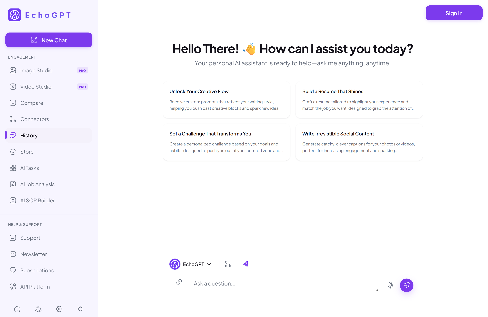

# EchoGPT — Frontend Redesign

A modern frontend redesign of the **EchoGPT web application**, focused on improving the overall UI/UX, usability, accessibility, responsiveness, and visual consistency while preserving the core structure of the original product.

🔗 **Live Demo:** https://echogpt-app-redesign.vercel.app/
💻 **GitHub:** https://github.com/MahmudaJahan99/echogpt-redesign

---

## 📌 Project Overview

This project was developed as part of a frontend engineering internship practical assignment. The goal was to analyze the existing EchoGPT interface and create a more modern, usable, responsive, and accessible experience. Rather than completely changing the product structure, the redesign maintains the familiar EchoGPT workflow while introducing significant improvements to the interface, component organization, interaction patterns, and accessibility.

The project focuses specifically on the **EchoGPT web application redesign**.

> **Note:** This is a frontend-focused implementation. It does not connect to a real AI backend or process real AI requests.

---

## ✨ Key Features

### 💬 Chat Interface

- Redesigned conversational interface
- Improved prompt/input experience
- Clearer visual hierarchy
- Better spacing and content organization
- Responsive chat layout

### 🤖 AI Model Selection

- Interactive AI model selector
- Model details interface
- Model-specific information display
- Improved model selection experience

### 🧭 Sidebar Navigation

- Redesigned navigation structure
- Clear grouping of application features
- Improved visual hierarchy
- Interactive navigation items
- Status/upgrade indicators where appropriate

### 🔝 Header / Navbar

- Improved application header
- Accessible interactive controls
- Better spacing and alignment
- Responsive behavior

### ⚙️ Settings

- Redesigned settings interface
- Organized controls and options
- Accessible interactive elements

### 🚀 Upgrade Modal

- Redesigned upgrade experience
- Clear information hierarchy
- Keyboard-accessible modal interaction
- Improved focus handling

### 🎛️ Interactive UI

Several interface elements are functional, including:

- AI model switching
- Dropdown menus
- Modal open/close interactions
- Navigation interactions
- Interactive buttons and controls

---

## ♿ Accessibility

Accessibility was an important part of the redesign.

The interface includes several accessibility-focused improvements:

- Semantic HTML elements
- Keyboard navigation
- Visible focus states
- Accessible buttons and controls
- ARIA labels where appropriate
- `aria-expanded` states for expandable controls
- Screen-reader-friendly labels
- Accessible tooltips
- Keyboard-accessible modals
- Improved modal focus handling
- Reduced-motion considerations

The goal was to make the interface easier to navigate and understand for users with different interaction needs, while keeping the experience visually consistent.

---

## 📱 Responsive Design

The application is designed to work across different screen sizes, including:

- Desktop
- Tablet
- Mobile

The layout adapts to different viewport sizes while maintaining the core navigation and chat experience.

---

## 🛠️ Technology Stack

| Technology       | Purpose                                   |
| ---------------- | ----------------------------------------- |
| **React**        | Building the user interface               |
| **TypeScript**   | Type-safe development                     |
| **Vite**         | Development environment and build tooling |
| **Tailwind CSS** | Styling and responsive UI                 |
| **React Router** | Client-side routing                       |

---

## 🎨 Design Approach

The redesign follows a few core principles:

### 1. Clear Visual Hierarchy

Important actions and information are given stronger visual emphasis, while secondary controls remain visually quieter.

### 2. Consistent Interaction Patterns

Similar UI elements use consistent interaction and visual patterns throughout the application.

### 3. Reduced Cognitive Load

The interface is organized so users can quickly identify:

- Where they are
- Which model they are using
- Where to enter a prompt
- Which actions are available
- Where application settings can be accessed

### 4. Accessibility First

Accessibility considerations were incorporated directly into the interface rather than treated as a separate final step.

---

## 🖼️ UI Preview

### Main Application

_Add screenshot here_

---

## 👩‍💻 Author

**Mahmuda Jahan**

Frontend Developer | React | TypeScript

GitHub: [MahmudaJahan99](https://github.com/MahmudaJahan99)
